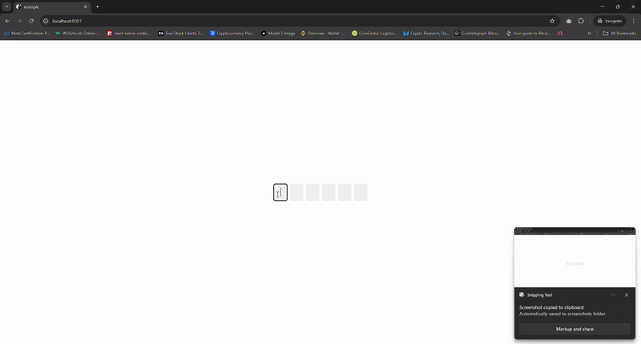

# @jkrmarmol/react-native-otp-input

A lightweight, **pure React Native** OTP input component for iOS, Android, and Web — no dependencies, fully customizable, and smooth keyboard handling across platforms.

## ✨ Features

- 🔢 Dynamic OTP length (default: 6)
- 🔒 Optional secure input (e.g., for PINs)
- 🧠 Smart auto-focus and backspace navigation
- 🌐 Works on React Native Web
- 🎨 Customizable styles for inputs and container
- ✅ Prevents skipping inputs or random field focus

## 📦 Installation

## Installation

```bash
npm install @jkrmarmol/react-native-otp-input
# or
yarn add @jkrmarmol/react-native-otp-input
```

## 📸 Preview

<p>
  
  <br />
  
  
</p>

## 🧪 Example

```js
import { View, StyleSheet } from 'react-native';
import OTPInput from '@jkrmarmol/react-native-otp-input';

export default function App() {
  return (
    <View style={styles.container}>
      <OTPInput
        length={6}
        onChangeOTP={(otp) => console.log(otp)}
        inputStyle={{
          backgroundColor: '#f0f0f0',
          borderBottomWidth: 0,
          borderRadius: 5,
        }}
      />
    </View>
  );
}

const styles = StyleSheet.create({
  container: {
    flex: 1,
    justifyContent: 'center',
    alignItems: 'center',
  },
});
```

| Prop             | Type                    | Default | Description                                                 |
| ---------------- | ----------------------- | ------- | ----------------------------------------------------------- |
| `length`         | `number`                | `6`     | Number of OTP digits                                        |
| `onChangeOTP`    | `(otp: string) => void` | `-`     | Callback when OTP input changes                             |
| `secure`         | `boolean`               | `false` | Masks input (like passwords or PINs)                        |
| `containerStyle` | `StyleProp<ViewStyle>`  | `-`     | Custom style for the container                              |
| `inputStyle`     | `StyleProp<TextStyle>`  | `-`     | Custom style for each input box                             |
| `cursorColor`    | `ColorValue`            | `-`     | Sets the cursor color of each input (Only works on Android) |

## Contributing

See the [contributing guide](CONTRIBUTING.md) to learn how to contribute to the repository and the development workflow.

## License

[MIT](./LICENSE)

---

Created with ❤️ by [Kurt Russelle Marmol](github.com/jkrmarmol)
